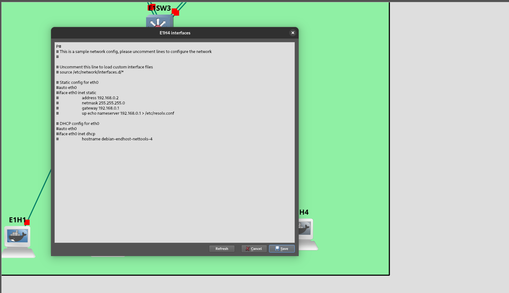

# debian-gns3-endhost-nettools

Debian docker image with a variety of network tools (available in [Docker Hub](https://hub.docker.com/r/mortzkeb/debian-gns3-endhost-nettools)). This can be especially useful if you need end host for GNS3 or EVE-NG for example.

Based in `debian:12-slim`

### Docker Pull Command 

``` bash
docker pull mortzkeb/debian-gns3-endhost-nettools
```

## Available commands and programs
- ip
- ifconfig
- route
- ssh
- telnet
- nc
- ncat
- bridge
- netstat
- hostname
- dhcpcd
- nmap
- arp-scan
- curl
- wget
- socat
- nslookup
- dig
- ping
- sftp 
- ufw
- iptables
- traceroute

and more! 

# Troubleshooting 
## Start DHCP client at startup

**UPDATE: when starting a host, DHCP is now enabled by default. Which would leave this section deprecated.** 

By default, when starting a container, the `/etc/network/interfaces` file does not start any configuration for IP assignment because all its lines are commented out. 

GNS3 allows us to enter the `interfaces` file before starting the container and modify the file to allow, for example, the DHCP client to start sending discover requests or to assign a static IP to the container. 

`Right click on the container -> Click on 'Edit config'`


It is rare but it can happen that the changes do not occur, as happened to David Bombal in this [video](https://youtu.be/Rltdel1tG-I?t=34), in that case, you can start the container and access with `nano` to edit directly the `interfaces` file. Then they shut down and bring up the container again. 
